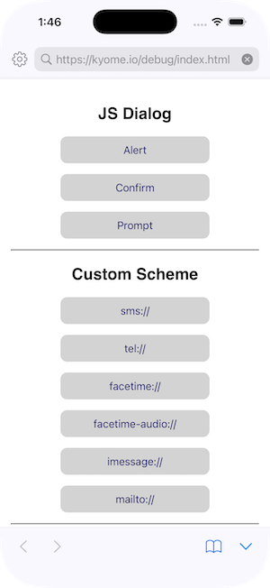
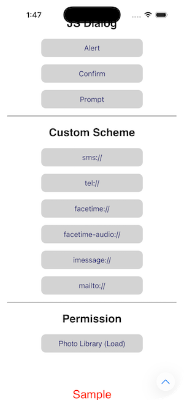
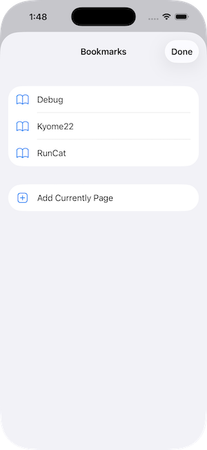
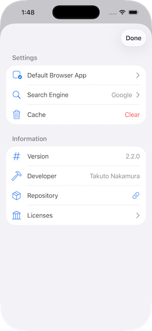
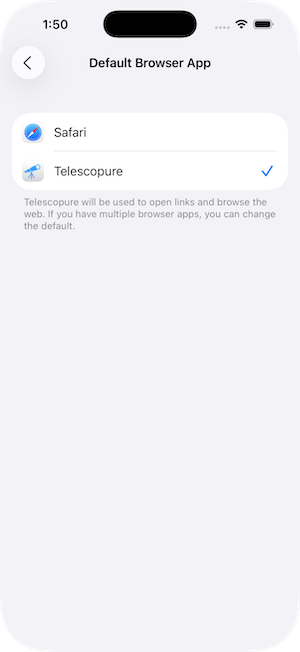
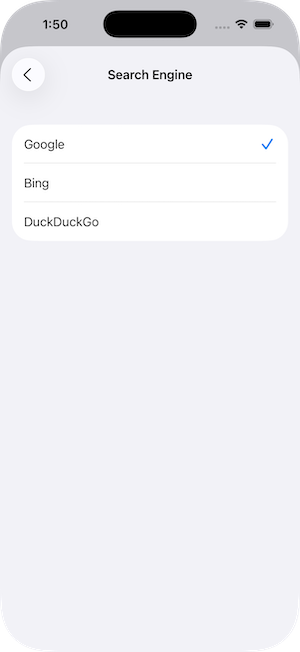
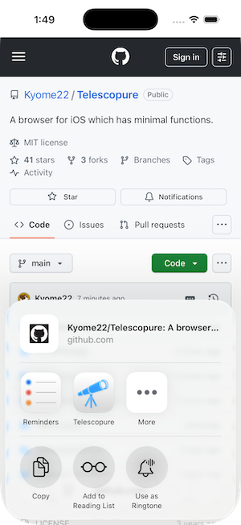
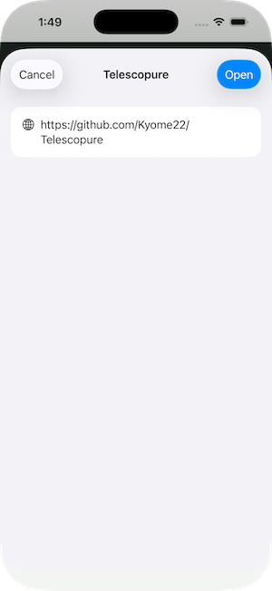

#  Telescopure

Telescopure is a browser for iOS which has minimal functions.<br>
You can use Telescopure to debug your application that work with the browser.

Download this app from App Store.<br>
https://apps.apple.com/us/app/telescopure/id1643406104

## Functions

- Settable as default browser.
- Open an HTTP or HTTPS link.
- Search by keywords.
- Browse a page in the full screen.
- Pull to refresh a page.
- Page Zoom.
- Bookmark user's favorite page.
- Open a link of other app in Telescopure.
- User can select a search engine (Google/Bing/DuckDuckGo).
- Support light and dark themes.

## Requirements

- Written in Swift 6.2
- Compatible with iOS 18.0+
- Development with Xcode 26.0.1+

## Supported languages

- English (primary)
- Japanese
- Korean

## Screenshots

<div>
  
  
  
  
</div>

<div>
  
  
  
  
</div>

## Implementation

- SwiftUI based App
- WKWebView wrapped in UIViewRepresentable
- Share Extension

## Tree

```plain
.
├── LocalPackage
│   ├── Package.swift
│   ├── Sources
│   │   ├── DataSource
│   │   ├── Model
│   │   └── UserInterface
│   └── Tests
│       └── ModelTests
├── Telescopure
│   ├── Assets.xcassets
│   ├── Info.plist
│   ├── InfoPlist.xcstrings
│   ├── Settings.bundle
│   └── TelescopureApp.swift
├── Telescopure.xcodeproj
├── Telescopure.xctestplan
├── TelescopureShare
│   ├── MainInterface.storyboard
│   ├── Info.plist
│   ├── InfoPlist.xcstrings
│   └── ShareViewController.swift
└── TelescopureUITests
    └── TelescopureUITests.swift
```

## Default Browser

Telescopure can be set as default browser app.

[Apple - Preparing your app to be the default web browser](https://developer.apple.com/documentation/xcode/preparing-your-app-to-be-the-default-browser)

## Debug Functions

The following page can be used for debugging Telescopure.

https://kyome.io/debug/index.html

### JS Dialogs

| Type    | Function           |
| :------ | :----------------- |
| Alert   | `window.alert()`   |
| Confirm | `window.confirm()` |
| Prompt  | `window.prompt()`  |

### Custom Schemes

| Type      | Scheme                              |
| :-------- | :---------------------------------- |
| SMS       | `sms://`                            |
| Telephone | `tel://`                            |
| FaceTime  | `facetime://` & `facetime-audio://` |
| iMessage  | `imessage://`                       |
| Mail      | `mailto://`                         |

### Permissions

| Category             | Permission                                                                                |
| :------------------- | :---------------------------------------------------------------------------------------- |
| Photo Library (Load) | `WKWebView` does not require permission to upload photos/videos.                          |
| Photo Library (Save) | Privacy - Photo Library Additions Usage Description (`NSPhotoLibraryAddUsageDescription`) |
| Device Location      | Privacy - Location When In Use Usage Description (`NSLocationWhenInUseUsageDescription`)  |
| Camera               | Privacy - Camera Usage Description (`NSCameraUsageDescription`)                           |
| Microphone           | Privacy - Microphone Usage Description (`NSMicrophoneUsageDescription`)                   |
