#  MinBrowser

A browser for iOS which has minimal functions.<br>
You can use MinBrowser to debug your application that work with the browser.

## Functions

- Open an HTTP or HTTPS link.
- Search by keywords.
- Full screen
- Pull to refresh
- Bookmark
- Open link in MinBrowser via other app.
- Support themes (light/dark).
- Localized (English, Japanese).

## Requirements

- Written in Swift 5
- Compatible with iOS 15.0+
- Development with Xcode 13.4.1+

## Screenshots

### Top

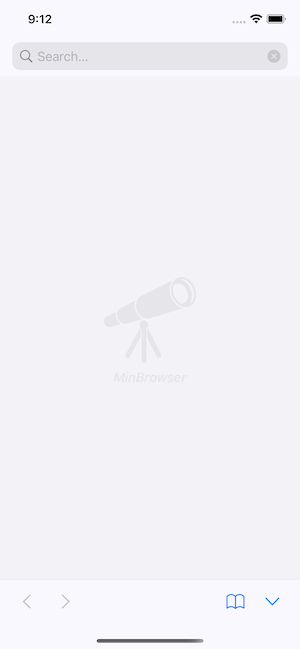&nbsp;&nbsp;
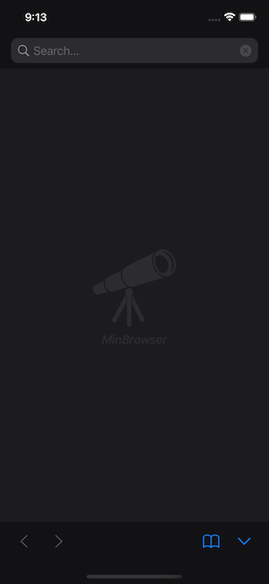

### Browsing

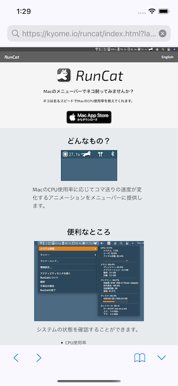&nbsp;&nbsp;
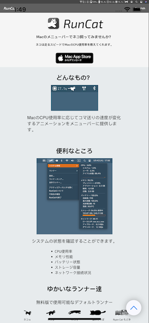&nbsp;&nbsp;
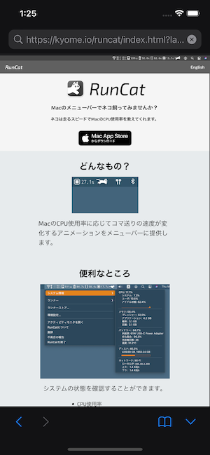&nbsp;&nbsp;


### Bookmark

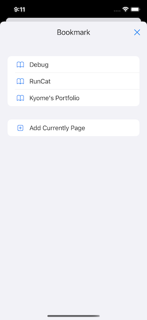&nbsp;&nbsp;
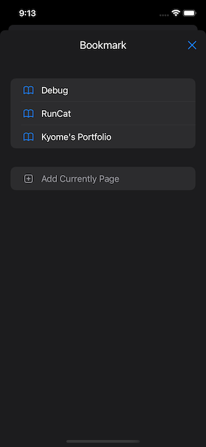

### Open link via other app

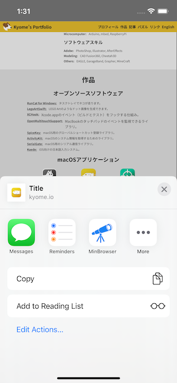&nbsp;&nbsp;
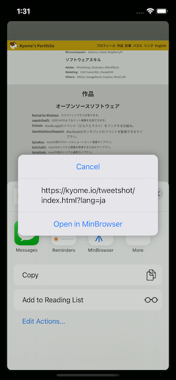&nbsp;&nbsp;
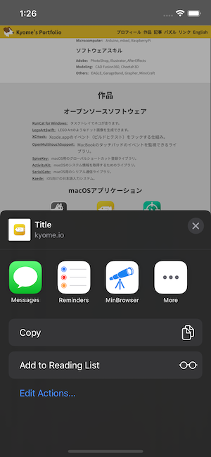&nbsp;&nbsp;
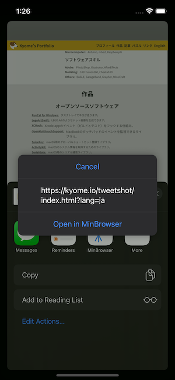

## Implementation

- SwiftUI based App
- WKWebView wrapped in UIViewRepresentable
- UIAlertController via ViewModifier
- Share Extension

## Tree

```plain
.
├── MinBrowser
│   ├── Assets.xcassets
│   ├── DebugLog.swift
│   ├── Extensions
│   │   ├── Color+Extensions.swift
│   │   ├── String+Extensions.swift
│   │   └── WKWebView+Extension.swift
│   ├── Info.plist
│   ├── InfoPlist.strings
│   ├── Localizable.strings
│   ├── MinBrowserApp.swift
│   ├── View
│   │   ├── Alert
│   │   │   ├── LegacyAlertModifier.swift
│   │   │   └── MigratedAlertModifier.swift
│   │   ├── BookmarkView.swift
│   │   ├── HideToolBarButton.swift
│   │   ├── LogoView.swift
│   │   ├── SearchBar.swift
│   │   ├── ToolBar.swift
│   │   ├── WebView.swift
│   │   └── WrappedWKWebView.swift
│   └── ViewModel
│       ├── Bookmark.swift
│       ├── Mock
│       │   └── WebViewModelMock.swift
│       └── WebViewModel.swift
└── MinBrowserShare
    ├── Info.plist
    ├── Localizable.strings
    ├── MainInterface.strings
    ├── View
    │   ├── ShareView.swift
    │   └── ShareViewController.swift
    └── ViewModel
        ├── Mock
        │   └── ShareViewModelMock.swift
        └── ShareViewModel.swift
```

## How to be the Default Browser

The goal is to make MinBrowser the Default Browser.

[Apple - Preparing Your App to be the Default Browser or Email Client](https://developer.apple.com/documentation/xcode/preparing-your-app-to-be-the-default-browser-or-email-client)

## Debug Functions

The following page can be used for debugging MinBrowser.

https://kyome.io/debug/index.html

### JS Dialog

- Alert (`window.alert()`)
- Confirm (`window.confirm()`)
- Prompt (`window.prompt()`)

### Custom Scheme

- SMS `sms://`
- Telephone `tel://`
- FaceTime `facetime://` and `facetime-audio://`
- iMessage `imessage://`
- Mail `mailto://`

### Permission

- Photo Library (Load)
  - `WKWebView` does not need permission to upload photos/videos.
- Photo Library (Save)
  - Privacy - Photo Library Additions Usage Description (`NSPhotoLibraryAddUsageDescription`)
- Device Location
  - Privacy - Location When In Use Usage Description (`NSLocationWhenInUseUsageDescription`)
- Camera/Microphone
  - Privacy - Camera Usage Description (`NSCameraUsageDescription`)
  - Privacy - Microphone Usage Description (`NSMicrophoneUsageDescription`)
