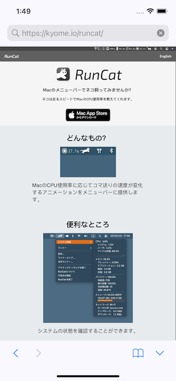
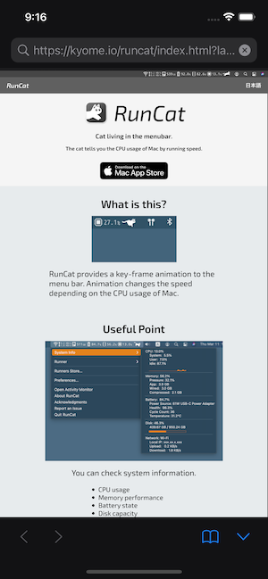
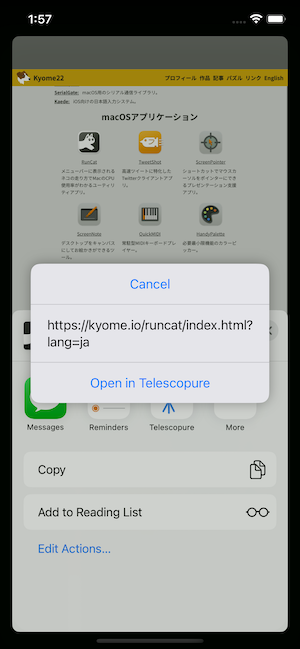
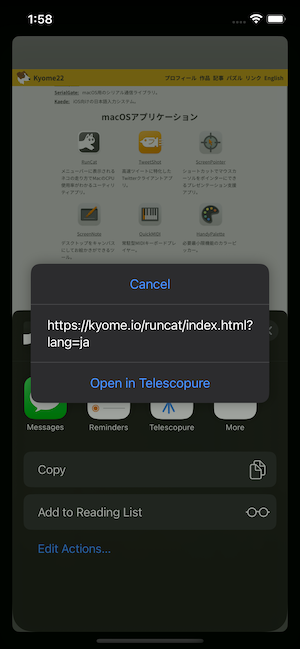

#  Telescopure

Telescopure is a browser for iOS which has minimal functions.<br>
You can use Telescopure to debug your application that work with the browser.

Download this app from App Store.<br>
https://apps.apple.com/us/app/telescopure/id1643406104

## Functions

- Open an HTTP or HTTPS link.
- Search by keywords.
- Browse a page in the full screen.
- Pull to refresh a page.
- Bookmark user's favorite page.
- Open a link of other app in Telescopure.
- User can select a search engine (Google/Bing/DuckDuckGo).
- Support light and dark themes.
- Localized (English, Japanese).

## Requirements

- Written in Swift 6.1
- Compatible with iOS 18.0+
- Development with Xcode 16.4+

## Screenshots

### Top

<div>
  
  
</div>
    
### Browsing

<div>
  
  
  
  
</div>
    
### Bookmark

<div>
  
  
</div>

### Open link via other app

<div>
  
  
</div>
    
## Implementation

- SwiftUI based App
- WKWebView wrapped in UIViewRepresentable
- Share Extension

## Tree

```plain
.
├── LocalPackage
│   ├── Package.swift
│   ├── Sources
│   │   ├── DataSource
│   │   ├── Model
│   │   └── UserInterface
│   └── Tests
│       └── ModelTests
├── Telescopure
│   ├── Assets.xcassets
│   ├── Info.plist
│   ├── InfoPlist.xcstrings
│   ├── Settings.bundle
│   └── TelescopureApp.swift
├── Telescopure.xcodeproj
├── Telescopure.xctestplan
├── TelescopureShare
│   ├── MainInterface.storyboard
│   ├── Info.plist
│   ├── InfoPlist.xcstrings
│   └── ShareViewController.swift
└── TelescopureUITests
    └── TelescopureUITests.swift
```

## How to be the Default Browser

The goal is to make Telescopure the Default Browser.

[Apple - Preparing Your App to be the Default Browser or Email Client](https://developer.apple.com/documentation/xcode/preparing-your-app-to-be-the-default-browser-or-email-client)

## Debug Functions

The following page can be used for debugging Telescopure.

https://kyome.io/debug/index.html

### JS Dialog

- Alert (`window.alert()`)
- Confirm (`window.confirm()`)
- Prompt (`window.prompt()`)

### Custom Scheme

- SMS `sms://`
- Telephone `tel://`
- FaceTime `facetime://` and `facetime-audio://`
- iMessage `imessage://`
- Mail `mailto://`

### Permissions

- Photo Library (Load)
  - `WKWebView` does not need permission to upload photos/videos.
- Photo Library (Save)
  - Privacy - Photo Library Additions Usage Description (`NSPhotoLibraryAddUsageDescription`)
- Device Location
  - Privacy - Location When In Use Usage Description (`NSLocationWhenInUseUsageDescription`)
- Camera/Microphone
  - Privacy - Camera Usage Description (`NSCameraUsageDescription`)
  - Privacy - Microphone Usage Description (`NSMicrophoneUsageDescription`)
